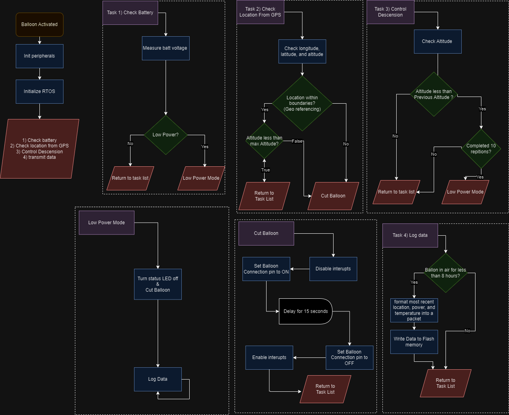

# HIGH ALTIBUTE BALLOON: ONBOARD COMPUTER
The Onboard Computer(OBC) for the High-Altitude Balloon(HAB) is a firmware system built on a STM32 microcontroller.

## Table of Contents
- [Overview](#overview)
  - [Mission](#mission)
  - [Goals](#goals)
- [Directory Structure](#directory-structure)
- [Usage](#usage)
- [License](#license)
- [Acknowledgements](#acknowledgements)

## Overview
### Mission
The HAB acts as a simulation tool to replicate the satellite's systems under similar environments.
### Goals
The goal of the HAB is to gain experience in :
- Communication Systems
- GroundStation System
- Iterative Software Design 

## Getting started

This project utilizes git hook for code formatting on commits, config your `hooksPath` with

```sh
git config core.hooksPath .githooks
```

## Directory Structure
### Core/Src/:
- *main.c*: Contains the main control logic and core functions.
- *HAWB_APRS.c*: Contains functions related to location and altitude.
- *data_storage.c*: Contains functions for writing data to flash memory.
- *retarget.c*: Contains functions related to serial communication on the boards
### testing/:
- *read_serial.py*: Contains functions for serial communication through terminal
### Core/Inc/:
- All header files included here.
- Header Files incude data structures and function definitions.
## Usage 
This project contains the firmware for an embedded system designed to monitor battery status, location, and other parameters. The system logs data periodically and can enter a low power mode to conserve energy. It utilizes Universal Asynchronous Receiver Transmitter (UART) for communication and Analog-to-Digital Converter (ADC) for sensor measurements.

### Main file
The file that runs the entire program is `main.c`.
> `Main.c` is run based on the function [`StartPollingLoop`](./Core/Src/main.c#L936-L959). 
>


- **[checkBattery](./Core/Src/main.c#L240-L246)**: Checks the battery voltage using the `getVoltage` function. If the voltage is below a predetermined value, it initiates the `lowpowerMode` function.
- **[getVoltage](./Core/Src/main.c#L203-L220)**: Reads the value from a specific ADC pin and converts it to a voltage value using a macro.
- **[checkLocation](./Core/Src/main.c#L259-L272)**: Utilizes the `getLocation` function to read the latitude and longitude, and the `checkAltitude` function to read the altitude. If certain conditions are met, the `cutBalloon` function is called.
- **[getLocation](./Core/Src/HAWB_APRS.c#L21-L23)**: Reads and returns the current latitude and longitude.
- **[checkAltitude](./Core/Src/main.c#L248-L257)**: Checks the current altitude against certain conditions.
- **[cutBalloon](./Core/Src/main.c#L177-L188)**: Initiates the procedure to cut the balloon if certain conditions are met.
- **[lowpowerMode](./Core/Src/main.c#L190-L201)**: Enters an infinite loop that reduces system load using interrupts. Continuously logs data using the `logData` function.
- **[logData](./Core/Src/main.c#L167-L175)**: Logs data periodically by capturing it using the `fetchData` function and writing it to flash memory with the `write_Data` function.
- **[fetchData](./Core/Src/main.c#L156-L165)**: Captures all relevant data into a structure containing all possible values.
- **[write_Data](./Core/Src/data_storage.c#L34-L50)**: Writes the captured data to flash memory.

### Data Storage 
This code provides functionality to erase, write, and read data from the flash memory of an embedded system. The code is structured with the following functions:

- **[erase_bank()](./Core/Src/data_storage.c#L3-L32)**: Erases a specific bank of flash memory.
- **[write_Data()](./Core/Src/data_storage.c#L34-L50)**: Writes data to flash memory.
- **[read_data()](./Core/Src/data_storage.c#L52-L57)**: Reads data from flash memory and transmits it over UART.
- **[test_log_data()](./Core/Src/data_storage.c#L59C1-L100C2)**: Tests the logging of data into flash memory.
- **[test_read_data()](./Core/Src/data_storage.c#L102-L116)**: Tests reading data from flash memory and transmitting it over UART.

### APRS
This file contains functions for handling APRS (Automatic Packet Reporting System) data over SPI (Serial Peripheral Interface) using DMA (Direct Memory Access). It includes functions to receive location data, handle SPI callbacks, and read big endian data.

- **[getLocation()](./Core/Src/HAWB_APRS.c#L21-L23)**
  - Copies the received data from the SPI DMA to the `Position` data type.
  - `pos`: The `Position` variable to store data in.
  - Returns The status of the SPI peripheral.

- **[getLocationClbk()](./Core/Src/HAWB_APRS.c#L30-L34)**:A callback function that reads the big endian data from the APRS.
  

- **[readBE4SPI()](./Core/Src/HAWB_APRS.c#L41-L47)**:Helper function to read big endian 4-byte data types.
  
### Retarget
The `retarget file` is meant to allow us to use C functions printf and scanf directly in the terminal [[1]](#acknowledgements). This along with the file `read_serial` allows us to send and recieve serial communication through the terminal and the board.
## Acknowledgements
[1] S. Hymel, “How to use printf on STM32,” Shawn Hymel, https://shawnhymel.com/1873/how-to-use-printf-on-stm32/
